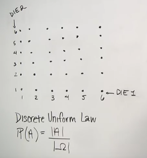

# Lecture 1
Lecture Outline
- Probability as a mathematical framework for reasoning about uncertainty
- Probabilistic models
sample space, probability law
- Axioms of probability
- Simple examples
- What does it take to set up a probabilistic model
- What are the basic rules for dealing with the basi probabilistic models

Probability is a mathematical framework for dealing with uncertainty (randomness). 
### What is Sample Space?
---
The set of all possible outcomes in an experiment. 
    
  >**Mutually Exclusive:** One outcome happening means others don't happen.

  >**Collectively Exhaustive:** The set includes all possible outcomes (at least one outcome must occur). 

* There can be numerous details in practical scenarios, what we consider relevant depends on our judgment, making it an art.

This sample space is finite.

This sampe space is infinite.
### When to choose sequential description?
---
Sequential Description is useful when the experiment has multiple stages (A tree-based).

* Sample space could be infinite. 

### What is an event?
---
The probability of hitting a specific point in this rectangle to infinite percision will be intuitively 0. (not helpful) So its better to assign probabilities to subsets of the sample space. So we can measure the probability of a event to occur or not. 

### AXIOMS
Ground rules that any legitimate probabilistic model should obey
1.  $P(A) \geq 0$ for all $A \subset S$ 
2.  $P(S) = 1$
3.  If $A \cap B = \emptyset$,
    then $P(A \cup B) = P(A) + P(B)$

* Another rule is probability stays between 0 & 1.

$$1^{(2)} = P(\Omega) = P(A \cup A^c)$$
$$^{(3)}P(A) + P(A^c)$$
$$P(A)= 1 - P(A^c)≤ 1$$

### The 3rd axiom for many (finite) sample space
P(AUBUC) = P((AUB)UC)= P(AUB)+P(C) = P(A)+P(B)+P(C)
### Task1

We have a sample space and we need to assign a probability law- We let every possible outcome have the probability of 1/16

* P({X=1}) = 4/16
* P(X+Y is odd)= 8/16
* P(min(X,Y)=2)=5/16

### Discrete Uniform Law
If all outcomes be equally likely 
P(A)= $\frac{Number of elements of A}{Total number of sample points}$

Computng probabilities = counting
This defines fair coins, fair dice, well shuffled decks 
### Continuous Uniform Law

Probability = Area
* P(X+Y ≤ 1/2) = 1/8
* P((X,Y)=(0.5,0.3))=0

# Lecture 2

### Concept of conditional probability
Info is always partial. 
random experiment → partial info → conditional probability
* The unit square is the union of one element set consisting of all the points. So the unit square is made up by the union of the various point inside the square

1= P(□) = P(U{(x, y)}) = Σ P ({x,y}) = Σ0 = 0

The third expression above isn't valid. It isn't a sequaence of sets; we can't exhaust the whole unit square by taking a sequence of elements inside it and cover the whole unit. Because infinite sets are not all of the same size. Continuous sets like the unit square is a bigger set (uncountable); having more sequence than any sequence could have.

* The 0 probalility means- its highly unlikely by itself. In such continuous probability models 0 probability outcomes are everything that happens. 

P((x, y) ≠ (0,0) = 1
* Probability of 1 means essential certainty it still allows the possibility that the outcome might be outside that set.
### Concept of conditional probability (Cont.)
Based on my knowledge of the world, we set up the probability model and we write down probabilities for the different outcomes.
New info → Changes belief (revising beliefs) → Conditional probabilities

  

    1/6
  

  

    3/6
    2/6
  

P(A|B) = probability of A, given B occurred
### Definition of Conditional Probability
P(B) = 0
P(A|B) = $\frac{P(A∩B)}{P(B)}$
P(A|B) undefined if P(B) = 0
#### Interpretetion in terms of frequency
P(A∩B) = P(B) P(A|B)

When the experment is done over and over again, what fraction of time it is going to be the case that both A and B occurs?
You only look at those experiments at which B happens to occur & what fractions of those experments where B already occurred, event A also occurs.

### Additivity Law
A∩B = ∅
P(A∩B|C) = P(A|C)+P(B|C)

  

  

  

  

  

  

  

  
  

  

  

  

  

  

  

  

  

X First roll
(By the Y axis, Y first roll)

* Let B be the event : min(X,Y)=2
* Let M = max(X, Y)
* P(M=1 | B) = 0
* P(M=2 | B) = $\frac{P(M=2 ∩ B)}{P(B)}$

Whenever w ehave a uiform distribution on out initial smaple space, when we condition a new event, our new distributon is still going to be uniform- but the smaller event of that we considered. 
### The model in terms of conditional probabilities
P((A∩B) P(C|A∩B)) = P(A∩B) P(C|A∩B) = P(A) P(B|A) P(C|A∩B)

### Total Probability Theorem
* divide & conquer
Partition of sample sapce into A1, A2, A3

  

  

  

  

we imagine 3 areas here A1, A2, A3

## Bayes' Theorem Statement

Let $E_1, E_2, ..., E_n$ be a set of events associated with a sample space $S$, where all the events $E_1, E_2, ..., E_n$ have nonzero probability of occurrence and they form a partition of S. Let A be any event associated with S, then according to Bayes theorem,
for any $k = 1, 2, 3,...., n$

## Venn Diagram Representation

$$P(E_i | A) = \frac{P(E_i)P(A | E_i)}{\sum_{k=1}^{n} P(E_k)P(A | E_k)}$$

# Lecture 3
Bayes' rule is the trivial half line calculation. 
### Inference
A situation on which there's a bunch or lots of different hypotheses about the environment. Given any parrticular setting in the environment, I may have a measuring device that may produce many different outcomes. I can observe the final outcome with my measuring device, trying to guess which particular branch occurred. Trying to guess the state of the world with paricular measurement.

### Property Independence
Two events are independent if and only if their probability of happening simultaneously is the equal of the product of their two individual probabilities.

* Independer is something we can check formally using these definition, but also we can check intuitivelyby if, in some casesyou can reason that whatever happens, that determines A is going to occur, or not, has absolitely nothing to do with whatever happens that determines whether B is going to happen or not.

* What events happen in one experiment aren't going to change our beliefs about what might be happeningin the other, because the sources of noise in these two experiments are completely unrelevant.
### Extreme dependence disjointness

    
A

    
B

These two circles as events, are seemingly different, as they are seperate, but aren't. Info about the occurrance of A in the sample space definitely affects our beliefs on possible occurance/non-occurance of B.
If A=1/3 & B=1/4
& P(A⋂B)=0
P(A) P(B)= 1/12
& P(A|B) = 0
P(A)=1/3
### Conditional Independence
Independence defined 
P(A⋂B)=P(A) P(B)
In conditional independence
P(A⋂B|C)=P(A|C) P(B|C)
This is the definition of conditional independence.

* In a particular experiment, where A & B are independent (A⋂B≠0), and C occurred, such that C has both some parts of A & B both included. 
Here A & B both are independent and disjoint. But the info that C occurrs biases the conception in such a way that in the new model, A and B are dependent.
"Having independence in the original model doesn't imply independence in conditional model"
# Lecture 4
Counting method apply in the situations in which we have probabilistic experiments with a fintie number of outcomes- where every possible outcome of the same possibility of occurring.

(Ω is the whole sample space, the circle is the A)
Ω has got a bunch of discrete points inside- the cardinality of set omega is N. The sample points are equally likely (P=1/N)
### Common trick of counting
When we consider a set with possible outcome, to describe the construction of those possible outcomes through a sequential process. 

We think of a probabilistic experiment that involves a number of stages, and in each stages there are a number of possible choices that there may be. The overall experiment consists of carrying out all the stages to the end. 
The number of possible leaves we have here is 4×3×2=24

  
Start

  

    

      
Branch 1

      

        

          
Sub-branch 1.1

          

            

              
Leaf 1.1.1

            

            

              
Leaf 1.1.2

            

          

        

        

          
Sub-branch 1.2

          

            

              
Leaf 1.2.1

            

            

              
Leaf 1.2.2

            

          

        

        

          
Sub-branch 1.3

          

            

              
Leaf 1.3.1

            

            

              
Leaf 1.3.2

            

          

        

      

    

    

      
Branch 2

      

        

          
Sub-branch 2.1

          

            

              
Leaf 2.1.1

            

            

              
Leaf 2.1.2

            

          

        

        

          
Sub-branch 2.2

          

            

              
Leaf 2.2.1

            

            

              
Leaf 2.2.2

            

          

        

        

          
Sub-branch 2.3

          

            

              
Leaf 2.3.1

            

            

              
Leaf 2.3.2

            

          

        

      

    

    

      
Branch 3

      

        

          
Sub-branch 3.1

          

            

              
Leaf 3.1.1

            

            

              
Leaf 3.1.2

            

          

        

        

          
Sub-branch 3.2

          

            

              
Leaf 3.2.1

            

            

              
Leaf 3.2.2

            

          

        

        

          
Sub-branch 3.3

          

            

              
Leaf 3.3.1

            

            

              
Leaf 3.3.2

            

          

        

      

    

    

      
Branch 4

      

        

          
Sub-branch 4.1

          

            

              
Leaf 4.1.1

            

            

              
Leaf 4.1.2

            

          

        

        

          
Sub-branch 4.2

          

            

              
Leaf 4.2.1

            

            

              
Leaf 4.2.2

            

          

        

        

          
Sub-branch 4.3

          

            

              
Leaf 4.3.1

            

            

              
Leaf 4.3.2

            

          

        

      

    

  

The total number of possible outcomes we have here is 4×3×2=24

### an example
We are given a set that consists of n elements; we are supposed to take them for putting them in a sequence.
n! is the number of permutations of n objets- the number of ways that one can order n objects that are given to you. 
* number of subsets for n elements is $2^n$
(each time we have the choice of putting it in the sequence or not)
### Axiom 1
Grounf rules that any legitimate probabilistic model should obey
1. Non-negativity: P(A)≥0
2. Normalization: P(Ω)=1
3. A∩B

## Counting

It helps us solve problems by figuring out how many ways we can arrange or choose things. This is crucial for understanding probability because many probability problems come down to counting the number of favorable outcomes and the total number of outcomes.

* having a probabilistic experiment with a finite number of outcomes, each equally likely. For example, rolling a fair die 6 times. The number of possible outcomes is calculated by raising the number of choices per roll to the power of the number of rolls:
\[
\text{Total Outcomes} = 6^6
\]

This formula works because each roll is independent of the others. So, the total number of outcomes is simply the product of choices for each stage.

### The Multiplication Principle

having multiple stages in an experiment, where each stage has a number of possible choices, the total number of outcomes is the product of the choices for each stage. 

**Example:** If you’re choosing a dish from a menu with 4 appetizers and 3 main courses, the number of possible meals is:
\[
4 \text{ (appetizers)} \times 3 \text{ (main courses)} = 12
\]

## Permutations:

When we need to arrange items in a specific order, we use permutations. 
How many different ways can we arrange 3 books on a shelf?
For each position, you have a choice of books:
- First position: 3 choices
- Second position: 2 remaining choices
- Third position: 1 choice left

 the total number of arrangements is:
\[
3! = 3 \times 2 \times 1 = 6
\]

## Combinations:

When the order doesn’t matter, we use combinations. For example, choosing 2 ice cream flavors from a list of 5. To find the number of ways to choose \(k\) items from \(n\) items, we use the combination formula:
\[
\text{Number of combinations} = \frac{n!}{k! \cdot (n - k)!}
\]

## Counting Subsets

If we have a set with \(n\) elements, the number of possible subsets is:
\[
2^n
\]

Why? For each element, we have two choices: include it in a subset or not. So, with \(n\) elements, you have \(2^n\) possible subsets.

## Understanding Special Cases

- **Subsets with Exact Number of Elements:**
  If you want to count subsets of exactly \(k\) elements from \(n\) elements, use the binomial coefficient:
  \[
  \binom{n}{k} = \frac{n!}{k! \cdot (n - k)!}
  \]

  **Example:** Choosing 3 people from a group of 10 to form a committee:
  \[
  \binom{10}{3} = \frac{10!}{3! \cdot (10 - 3)!} = 120
  \]

- **Extreme Cases:**
  For \(k = n\), you’re choosing all elements, so there's only one way to do it. Mathematically, this checks out with:
  \[
  \binom{n}{n} = 1
  \]

  Similarly, \(\binom{n}{0} = 1\) because there’s exactly one way to choose zero items (the empty set).

# Lecture 5
## Defining Random Variables
Random variables allow us to assign numerical values to the outcomes of an experiment, giving us a more tangible way to analyze and understand randomness. An experiment where we measure the height of a randomly chosen student from a class,the sample space \( \Omega \), is the set of all students in the class. A RV in this case,\( H \) for height—maps each student (an outcome) to a specific numerical value (their height in inches).

A random variable is a function that assigns a real number to every possible outcome of an experiment. 

## Types of Random Variables

A discrete random variable takes on a finite or countable number of possible values. For example, if we round a student’s height to the nearest inch, the random variable could only take integer values like 60, 61, 62, etc.On the other hand, a continuous random variable can take any value within a certain range. If we measure a student's height with infinite precision, the height could be any real number, making it a continuous random variable.

## Probability Mass Function (PMF)
The PMF assigns probabilities to each possible value that a discrete random variable can take; essentially, how likely each numerical outcome is. Example: flipping a coin until we get heads. Here, our random variable \( X \) might represent the number of tosses required to get the first head. If the first toss is a head, \( X = 1 \). If the first toss is a tail and the second is a head, \( X = 2 \). The PMF of \( X \) would then give the probabilities of these different values of \( X \).
The probability mass function is defined as:
\[
P_X(k) = P(X = k)
\]
 \( P_X(k) \) is the probability that the random variable \( X \) taking the value \( k \). The PMF must satisfy two conditions:
1. **Non-negativity**: \( P_X(k) \geq 0 \) for all \( k \).
2. **Normalization**: The sum of all probabilities must equal 1, \( \sum P_X(k) = 1 \).
## Examples of PMFs
We flip a fair coin until you get heads for the first time. If the number of tosses required to get the first head can be modeled as a geometric random variable, the PMF of this random variable \( X \) . Here \( X = k \) represents the event that the first head appears on the \( k \)-th toss, is given by:
\[
P_X(k) = (1 - p)^{k-1} p
\]
\( p \) is the probability of getting heads on a single toss.

\( (1 - p)^{k-1} \) represents the probability of getting \( k-1 \) tails before the first head.

For plotting this PMF, we'd notice that each successive bar (representing the probability of each value of \( X \)) gets smaller, creating a characteristic geometric decay. That's why it is called a geometric distribution.

## Random Variables as Functions

Random variables are essentially functions from the sample space to the real numbers. If \( H \) is the height of a student, it is a function that takes a student (an element of the sample space) and returns their height (a real number). Moreover, we can have functions of random variables that are also random variables. taking anexample, if we define a new random variable \( H' = H \times 2.54 \), which converts height from inches to centimeters, \( H' \) is a function of \( H \). Since \( H' \) still maps outcomes to real numbers, it is itself a random variable.

## Expected Value and Variance
The expected value or mean of a random variable gives a measure of the "center" or "average" value that the random variable takes on. Discrete random variable \( X \) with PMF \( P_X(k) \), the expected value \( E(X) \):
\[
E(X) = \sum_{k} k \cdot P_X(k)
\]
The variance of a random variable, on the other hand, measures the spread or "dispersion" of its possible values. It tells us how much the values of the random variable deviate from the mean. For a discrete random variable \( X \), the variance \( Var(X) \) is defined as:

\[
Var(X) = E[(X - E(X))^2] = \sum_{k} (k - E(X))^2 \cdot P_X(k)
\]
### Understanding Variance
1. Definition
Variance is a key statistical concept that measures how much the values of a random variable differ from its average value, or mean.
\[ \text{Var}(X) = E[(X - E[X])^2] \]
Think of variance as a measure of the spread of your data:
The example says having test scores that are very close to the average score, the variance will be low. Meaning the scores are not very spread out (consistent).By squaring the differences from the mean, variance gives more weight to larger deviations. So, if some test scores are very high or very low compared to the average, these will contribute more to the variance.
**2,Calculation:**
- **Random Variable Inside**: When you compute \( (X - E[X]) \), this result is still random because \( X \) is random, though \( E[X] \) is a constant.
- **Squared Deviation**: Squaring \( (X - E[X]) \) gives us a new random variable, which tells us the squared distance of each score from the mean. This random variable helps us understand how spread out the scores are.
* **Why Square the Deviations?**
* Squaring the deviations avoids the issue of positive and negative values canceling each other out. Without squaring them, the deviations might sum up to zero even if there is significant spread.
* By squaring, larger deviations from the mean have a disproportionately larger impact on the variance. This makes variance a useful measure for understanding how spread out or dispersed the values are.
Variance can also be computed using:

\[ \text{Var}(X) = E[X^2] - (E[X])^2 \]
here
- **\( E[X^2] \)**= This is the expected value of the square of \( X \). It represents the average of the squared values of the random variable.
- **\( (E[X])^2 \)**= This is the square of the mean of \( X \).
expanding the squared deviation formula:
\[ E[(X - E[X])^2] = E[X^2] - 2E[X]E[X] + (E[X])^2 \]
\[ \text{Var}(X) = E[X^2] - (E[X])^2 \]
### Importance of Variance
It provides a measure of how consistent or variable the data is. A high variance indicates a lot of variability, meaning the data points are spread out widely around the mean. A low variance indicates that the data points are clustered closely around the mean. Knowing the variance helps in assessing how predictable the data is. Lower variance means more predictability and stability, whereas higher variance suggests greater uncertainty.

# Lecture 6

## Random Variables and Expectations

## Random Variables

Random variables are like tools we use to assign numerical values to the outcomes of random experiments. For example, if we flip a coin, the result (heads or tails) is uncertain, but we can assign a numerical value to each outcome—let’s say 1 for heads and 0 for tails. In this way, the random variable translates the uncertain outcomes into numbers we can work with.

## Expectations and Expected Values

This isthe average value you would expect if you could repeat the experiment an infinite number of times.

### Expected Value

The **expected value** of a random variable is a weighted average of all possible values, where each value is weighted by its probability. Mathematically, it’s defined as:

\[ E(X) = \sum_{x} x \cdot P(X = x) \]

example: rolling a fair six-sided dice. The possible outcomes are 1 through 6. The expected value is:

\[ E(X) = \frac{1}{6}(1 + 2 + 3 + 4 + 5 + 6) = 3.5 \]

if we roll the dice quite a few time, the mean will be near 3.5.

## Functions of Random Variables

A random variable's \( X \) function \( g(X) \) is also a random variable. \( X \) represents the roll of a die and \( g(X) \) is the square of \( X \), then \( g(X) \) will be the square of the result of the die roll.

\[ E(g(X)) = \sum_{x} g(x) \cdot P(X = x) \]

shortcut:We can directly use the PMF of \( X \) to compute \( E(g(X)) \).

## Linearity of Expectation

If \( g \) is a linear function, the expectation behaves linearity:

\[ E(aX + b) = aE(X) + b \] in this way
## Variance and Standard Deviation
While the expected value gives us a central tendency, it doesn’t tell us how spread out the values are. To do this, we use **variance**. The variance is the average squared distance from the mean:

\[ \text{Var}(X) = E[(X - E(X))^2] \]

Variance has units that are the square of the units of \( X \).To get a more interpretable measure of spread, we use the standard deviation, which is the square root of the variance. It’s expressed in the same units as \( X \) and provides a clearer picture of the distribution's spread.
## Example1
We takea simple experiment where the distnce is 200 miles.we can either fly at 200 miles per hour or walk at 1 mile per hour. We flip a coin to decide which speed you’ll use. Let’s denote the speed by \( V \), and the time by \( T \). 

- With probability \( \frac{1}{2} \), \( V = 200 \) mph, and the time \( T \) is \( \frac{200}{200} = 1 \) hour.
- With probability \( \frac{1}{2} \), \( V = 1 \) mph, and the time \( T \) is \( \frac{200}{1} = 200 \) hours.

**Expected Speed**:
\[ E(V) = \frac{1}{2}(200) + \frac{1}{2}(1) = 100.5 \text{ mph} \]

**Variance of Speed**:
\[ \text{Var}(V) = \frac{1}{2} (200 - 100.5)^2 + \frac{1}{2} (1 - 100.5)^2 \approx 10000 \text{ (mph)}^2 \]

**Standard Deviation**:
\[ \text{SD}(V) = \sqrt{10000} = 100 \text{ mph} \]

**Expected Time**:
\[ E(T) = \frac{1}{2}(200) + \frac{1}{2}(1) = 100.5 \text{ hours} \]

Interestingly, the expected value of the product \( T \times V \) (which is always 200) is not the same as the product of their expected values (which is \( 100.5 \times 100.5 \)).

## Conditional Expectations

When we have new information, like knowing that a specific event has occurred, we use **conditional expectations**. For example, if we know \( X \) is greater than or equal to 2, we update our probabilities and expectations based on this new information.

The **conditional expectation** of \( X \) given an event \( A \) is:

\[ E(X | A) = \frac{\sum_{x \in A} x \cdot P(X = x | A)}{\sum_{x \in A} P(X = x | A)} \]

In the example where \( X \) was initially uniformly distributed, if we know \( X \geq 2 \), we conditionally update our PMF so that the probabilities of 2, 3, and 4 are each \( \frac{1}{3} \). The conditional expectation in this case would be 3.
# Lecture 7
* The Case of Three random variables
$P_{x,y,z}(x, y, z)$ 

This shows the probability that X takes the value, Y takes the value,  Z takes the value, simultaneously.

# Lecture 7

The joint PMF of two random variables gives us the probability of any pair of possible values of those variables occurring simultaneously.

Pₓ(x) = P(X=x) --> marginal  
Pₓᵧ(x,y) = P(X=x, Y=y) --> joint

* For the conditional PMF (a list of various conditions of conditional probabilities of interest):

Pₓ|ᵧ(x|y) = P(X=x | Y=y) --> conditional

* The probabilities of all x's need to add up to 1. So,

Σₓ Pₓ|ᵧ(x|y) = 1

[Hence, they are essentially like ordinary probabilities over the different x's in a universe where we know the value of y (random variable).]

> Joint to Marginal:

Pₓ(x) = Σᵧ Pₓᵧ(x,y)

> Conditional and Marginal to Joint:

Pₓᵧ(x,y) = Pₓ(x) Pᵧ|ₓ(y|x)

This resembles:

P(A∩B) = P(A) P(B|A)

Where:

- A = event where X takes value x
- B = event where Y takes value y
- Joint probability of A & B happening simultaneously.

**In case of 3 random variables (r.v.)**

Pₓᵧz(x,y,z) = P(x,y,z)

Pₓ(x) = ∑ᵧ,z Pₓᵧz(x,y,z)

[Fixing x and considering all the possible variables for the remaining y & z]

**Independent Random Variables**

Pₓᵧz(x,y,z) = Pₓ(x) Pᵧ|ₓ(y|x) Pz|ₓ,ᵧ(z|x,y)

We know it before like this:

P(A∩B∩C) = P(A) ⋅ P(B|A) ⋅ P(C|A,B)

* Three random variables are independent if and only if their joint probability mass function factors into the product of their individual probability mass functions:

Pₓᵧz(x,y,z) = Pₓ(x) ⋅ Pᵧ(y) ⋅ Pz(z)

* Random variables are independent if and only if knowing the realized values of some of these random variables doesn't change our beliefs about the likelihood of various values for the remaining random variables.

Thus, Pₓ|ᵧ(x|y) = Pₓ(x)

This means we have some original beliefs about how likely it is for X to take on certain values.

Now, if the information comes that Y took on a certain value, it would compel us to revise our beliefs, which is represented by Pₓ|ᵧ(x|y).

Independence means that our new revised beliefs will be the same as the original belief.

This conditional is only well-defined if the event that \(Y\) takes on that particular value has a positive probability. (\(Pᵧ(y) > 0\)). Thus, we can't condition on zero probabilities.

→ Similarly, for multiple random variables (r.v.):

Pₓ|ᵧ,z(x|y, z) = Pₓ(x)

**Example 1:**

Two discrete random variables:

|   y\x   | 1/20 | 2/20 | 1/20 |        |
|:-------:|:----:|:----:|:----:|:------:|
| **4**   | 2/20 | 2/20 |      | 2/20   |
| **3**   | 3/20 | 4/20 | 1/20 | 2/20   |
| **2**   | 1/20 | 2/20 | 1/20 |        |
| **1**   | 1/20 |      |      |        |

Table: Joint PMF table.

- **Independent?**
Fixing the value of \(y\) each time changes what we expect or consider possible for the values of the other random variable.

The experiment is such that X≤2X≤2 and YY is larger than or equal to 3 (the upper fourth squares in the graph). This defines a new universe (A). Inside it, we will have a new joint PMF (probability mass function) that is conditioned on the event that this has occurred.
$P_{X,Y \mid A}$
|       |       |
|-------|-------|
| 1/20  | 2/20  |
| 2/20  | 4/20  |

here the ratios has to be the same as before and the probability should add uo to 1. 
|      |      |
|------|------|
| 1/9  | 2/9  |
| 2/9  | 4/9  |

Now, in this new universe is x independent from y

|      |      |
|------|------|
| 1/9  | 2/9  |

If we say that \( Y \) takes a specific value in this new universe, what information do we get about the value of \( X \)? This will be such that the right-sided value is twice as likely as the left-sided one. The same logic applies to the other half of the table. Hence, the conditional PMF in this new universe (the conditional PMF of \( X \) given \( Y \)) is the same as the marginal PMF of \( X \), but of course, in the new universe. So, no matter what \( Y \) is, the conditional PMF of \( X \) is the same.

The conditional PMF is 

$$ 
\frac{1}{3} 
$$ 

and 

$$ 
\frac{2}{3} 
$$.

This will be the conditional PMF of \( X \) in the new universe, regardless of the value of \( Y \). Therefore, \( Y \) doesn’t provide any information about \( X \) and doesn’t cause us to change any of our beliefs in this new universe. Thus, the two random variables are independent here.

Another way to verify that we have independence is to find the marginal PMFs of the two variables: is the joint PMF the product of the marginals? If yes, then the two random variables are independent in this universe (conditionally independent).

### Expectations

Expectation is like the average value of a random variable if we conduct an experiment repeatedly and interpret probabilities as frequencies. So, we get \( X \) over and over with a certain frequency \( P(x) \). Each time a particular value \( x \) is realized, if we receive \( x \) dollars, how many dollars would we get on average?

$$ E[X] = \sum_{z} p x (z) $$

This formula calculates the expected value, which represents the average outcome of a random variable. For calculating the expected value of a random variable, you don’t necessarily need to find the probability mass function (PMF) of that variable. Instead, you can work directly with the values x and y.

When performing an experiment multiple times, each outcome can be represented as a pair (x, y). Each time a specific pair (x, y) occurs, you receive a certain amount of dollars. The fraction of times a particular pair  (x, y) occurs, multiplied by the amount of dollars you receive, gives us the total amount you earn. The average amount, which is the expected value, reflects this calculation.

However, when discussing functions of random variables, it’s important to note that the expected value of a function of a random variable is not necessarily the same as the function of the expected value. The expected value of a function of a random variable is the average of that function, not the value of the function evaluated at the average.

### If \( X \) & \( Y \) are independent, what does it mean?

\( X \) doesn't convey any information about \( Y \) or vice versa. If that's the case, would \( g(X) \) tell us about \( h(Y) \)? Shouldn't be. Also, a no.

So, if \( X \) & \( Y \) are independent, \( g(X) \) & \( h(Y) \) are also independent.

### Expectation

\[
E[aX + b] = aE[X] + b \quad \text{(Linearity)}
\]

\[
E[X + Y] = E[X] + E[Y]
\]

For multiple random variables, the expectations still behave linearly.

**If \( X \) & \( Y \) are independent random variables, the product of two random variables has an expectation which is the product of the expectations:**

\[
E[X \cdot Y] = E[X] \cdot E[Y]
\]

In case we have independences, factoring out the PMFs:

\[
E[X \cdot Y] = \sum_{x} \sum_{y} xy P_{X}(x) P_{Y}(y)
\]

---

### Variance \( (\text{Var}) \)

\[
\text{Var}(X) = E[(X - E[X])^2]
\]

The random variable we are looking at minus the expected value of the random variable we're looking at. This is the difference of the random variable from its mean. Meaning it's the whole expression's expectation. Variance provides the idea of how spread out the distribution is.

The variance doesn't always behave linearly. If we take the constants with the variable, it just shifts the variance. The variance of the sum of independent random variables is the sum of the variances.

Therefore, we can apply the rule that in independent random variables, expectations multiply the right way!

---

### Example 1: The Binomial Distribution

Which counts the number of successes in \( n \) independent trials of a coin. It’s a biased coin having the probability of head (success) \( = p \) at each trial.

---

### How to calculate the expected value of the random variable

- **The probability of success \( p \)**

- The expected value of \( X_i \) is: \( E[X_i] = np \)

\[
\text{Var}(X_i) = np(1-p)
\]

\[
\text{Var}(X) = np(1-p)
\]

- A lot of problems in probability theory get easier by breaking up the random variable of interest into a sum of simpler & more manageable random variables that take values 0 or 1.

\[
E[X] = \sum_{k=0}^{n} k \cdot p(k) = np
\]

- If we plot the variance of X as a function of p then,

[Graph of variance against p with a parabolic shape]

[it’s 0 when p = 1 & 0, & it’s quadratic, so this will be the shape]

### The Hat Problem

n people threw their hats in a box and then pick one at random.

- X: number of people who get their own hat

- Find E[X]

Here, the "random" means any permutation of the hats is equally likely. So there’s complete symmetry between hats & people.

So, the total number of hats picked

X = X₁ + X₂ + X₃ + X₄ + ... + Xn

[X₁: if person 1 got their hat back, X₁ will be 1]

What's the probability that X₁ = 1?

By symmetry, n is the no. of hats, the chance is that they end up getting their own hat as opposed to any other (n - 1) hats is 1/n = P(X₁ = 1)

What's the expected value of X₁?

E[X₁] = 1 × 1/n + 0 × (1 - 1/n) = 1/n
- Are the X₁ independent? No

- The expected value of ∑X? 

Expectations are linear; expectation of a sum is the sum of expectation—it's always true.

E[X] = ∑E[X₁] = n × 1/n = 1

Only one will end up with their own hat.

As the X₁'s aren't independent, the variance of the sum isn't the same as the sum of the variance.

The general formula for the variance:

Var(X) = E[X]² - E[X²] = E[X]² - 1

X₁² = (∑ X₁)² = ΣX₁² + Σ (X₁Xj) for i ≠ j

E[X₁²] = E[X₁] = 1/n

- X₁X₂ = 1; what does this mean?

This means that they both are 1. (Since they can only be 0 or 1)

P(X₁X₂ = 1) = P(X₁ = 1) . P(X₂ = 1 | X₁ = 1) 
              = (1/n) . (1/(n-1))
              = E[X₁Xj] for i ≠ j

**Random Variable:**

Random variable is a function from the sample space to the real numbers, that is, you give me an outcome and based on that outcome I can tell you the value of that variable. So the value of the variable is a function of the outcome that we have.

Given the random variable, some of the outcomes are more likely than others, we want to say which ones are likely and how likely they are. (Probability of the different outcomes)

- **Uppercase** → RV
- **Lowercase** → real numbers

The random variable \(X\) happens to take the numerical value \(x\). The probability of that is \(P(X = x) = P_x(x)\).

**Expected value of a RV:**

\[
E[X] = \sum x P_x(x)
\]

\[
E[g(x)] = \sum g(x) P_x(x)
\]

Here, \(E[g(x)] \neq g(E[X])\) → generally it's not true. It means, we can't reason on average. But there are some exceptions like linearity:

\[
E[aX + b] = aE[X] + b
\]

Here, \(a\) & \(b\) are some constants.
E[X_1+X_2] = E[X_1] + E[X_2] \quad \text{if (X_1) \& (X_2) are independent)} 

The expectation is linear, but it's not true for Variance:

\[
Var[aX + b] = a^2 \cdot Var[X]
\]

---

**Side Notes:**

\[
E[Var[X]] = E\left[(X - E[X])^2\right] = E\left[X^2 - 2X E[X] + (E[X])^2\right]
\]
\[
= E[X^2] - 2E[X]E[X] + (E[X])^2 
\]
\[
= E[X^2] - (E[X])^2
\]

---

**Example:**

\[
E[X] = 1 \cdot \frac{1}{2} + 2 \cdot \frac{1}{2} = \frac{3}{2}
\]

\[
Var[X] = \left(1 - \frac{3}{2}\right)^2 \cdot \frac{1}{2} + \left(2 - \frac{3}{2}\right)^2 \cdot \frac{1}{2} 
\]
\[
= \frac{1}{4} \cdot \frac{1}{2} + \frac{1}{4} \cdot \frac{1}{2} = \frac{1}{2} \cdot \frac{1}{2} = \frac{1}{4}
\]
# Lecture 8
### Continuous Random Variables and Probability Density Functions

A continuous random variable can take any real number within a given range, unlike discrete variables that take values from a specific set. The outcome of an experiment determines the value of the random variable, which is a function on the sample space. Once a sample point is determined, the corresponding value of the random variable becomes fixed.

To describe the distribution of a continuous random variable, we are interested in determining the likelihood of the variable taking values within specific intervals, such as between \(a\) and \(b\). One way to compute the probability of this event is by finding all outcomes leading to values in this interval and calculating the corresponding probability. However, we simplify this process by focusing on the distribution of values directly on the real number line.

For discrete random variables, the **Probability Mass Function (PMF)** assigns probability masses to specific points. In contrast, for continuous random variables, probability is not concentrated at individual points but distributed over the real line. This distribution is described by the **Probability Density Function (PDF)**. A PDF represents how probability is spread along the real line.

In terms of visualization, the probability that a continuous random variable falls within a specific interval is represented by the area under the PDF curve over that interval. Mathematically, this area is calculated using an integral of the PDF. The PDF defines the overall shape and spread of the probability distribution along the real line.

For continuous random variables, the probability of the variable taking any exact value is zero, as the area under a single point on the PDF curve is zero. The PDF at a particular value reflects how probability is distributed around that value, not the probability of the value itself.

A PDF must satisfy the following conditions:

1. It must be non-negative since probabilities cannot be negative.
2. The integral of the PDF over the entire real line must equal 1, ensuring that the total probability is 1.

The PDF can also be interpreted as a probability per unit length. For small intervals, the probability of the variable falling within that interval is approximately the product of the length of the interval and the value of the PDF. This gives the PDF the interpretation of a "density" of probability, indicating how much probability is concentrated in small segments of the real line. Densities are not limited to values less than or equal to 1; they can take any non-negative value.

---

### Expectation and Variance

The **expectation (or expected value)** of a continuous random variable is calculated similarly to that of a discrete variable. It represents the center of gravity of the distribution described by the PDF. The expectation is computed by integrating the product of the variable’s value and the PDF over the entire range of possible values.

The **variance** and **standard deviation** of a continuous random variable measure the spread of the distribution around the mean (the expectation). Variance is the average squared deviation from the mean, and the standard deviation provides a sense of the spread in the same units as the variable.

---

### Uniform Distribution: An Example

A simple example of a continuous random variable is the **uniform distribution**, where the PDF is constant over a given interval \([a, b]\) and zero elsewhere. All values within the interval are equally likely. The probability of any individual value remains zero, but the probability of an interval is proportional to its length.

To ensure that the total probability sums to 1, the height of the PDF is set to:

\[
\frac{1}{b - a}
\]

The expectation of a uniform random variable is the midpoint of the interval, and the variance is:

\[
\frac{(b - a)^2}{12}
\]

In conclusion, continuous random variables are characterized by the spread of probability across a continuum, and probabilities are calculated using the area under the PDF curve. Properties such as expectation and variance are determined using integrals rather than sums, with the uniform distribution providing a straightforward case.
In probability theory, probability distributions are categorized into two major types: discrete and continuous.

A discrete probability distribution describes situations where the outcomes take on distinct values. The probability mass function (PMF), p(x)p(x), represents the likelihood of each discrete outcome occurring. A classic example is the binomial distribution, where a finite number of Bernoulli trials are conducted, and the outcomes can be heads or tails. The sum of all probabilities must equal 1:
∑x∈Sp(x)=1
x∈S∑​p(x)=1

A continuous probability distribution applies when the outcomes form a continuum of values. The probability density function (PDF), f(x)f(x), is used to describe the distribution over a continuous range. For continuous distributions, the probability of any single point is 0, but the area under the curve of the PDF over an interval gives the probability of the outcome falling within that range:
∫−∞∞f(x) dx=1
∫−∞∞​f(x)dx=1

For example, in the normal distribution, the probabilities are associated with intervals rather than exact values.

Mathematical expectation, or the expected value, of a random variable XX gives the mean of the probability distribution. For a discrete distribution, it is given by:
E(X)=∑xx⋅p(x)
E(X)=x∑​x⋅p(x)

For a continuous distribution, the expected value is computed as:
E(X)=∫−∞∞x⋅f(x) dx
E(X)=∫−∞∞​x⋅f(x)dx

The variance measures the spread of a distribution, indicating how much the values of a random variable deviate from the expected value. For a discrete distribution, the variance is:
Var(X)=E[(X−μ)2]=∑x(x−μ)2⋅p(x)
Var(X)=E[(X−μ)2]=x∑​(x−μ)2⋅p(x)

And for a continuous distribution:
Var(X)=∫−∞∞(x−μ)2⋅f(x) dx
Var(X)=∫−∞∞​(x−μ)2⋅f(x)dx

Where μ=E(X)μ=E(X) is the mean.

The central limit theorem states that the distribution of the sample mean of a large number of independent, identically distributed variables approaches a normal distribution, regardless of the shape of the original distribution. This theorem is fundamental in statistics, enabling approximations and inferences for a wide variety of practical problems.
In probability theory, the concept of standard deviations plays a critical role in understanding the distribution of random variables. Suppose XX has a mean of 2 and a variance of 16, which gives a standard deviation of 4. The goal is to calculate the probability of a particular event involving XX.

Consider the event X<3X<3. This can be rewritten in terms of the standardized variable:
X−2<3−2
X−2<3−2

This simplifies to:
X−24<3−24
4X−2​<43−2​

This is the standardized (or normalized) version of XX, which we now know follows a standard normal distribution, N(0,1)N(0,1). The question now becomes finding the probability that the standard normal variable is less than 0.250.25.

Using the standard normal table, we find:
P(Z<0.25)=0.5987
P(Z<0.25)=0.5987

This is a fundamental technique when calculating probabilities involving normal distributions. It's necessary to understand how to use the standard normal table and transform a general normal variable into a standard normal form.
# Lecture 9
### Lecture Notes on Continuous Random Variables and Joint Densities

In this lecture, we extended our discussion from discrete random variables to continuous random variables. Our goal is to understand their properties, how to calculate probabilities, expectations, and define concepts such as joint and conditional densities. 

### Transitioning from Discrete to Continuous Random Variables

We previously covered concepts such as the probability mass function (PMF) and expectation for discrete random variables. For continuous random variables, we replace these with the probability density function (PDF) and integrals. The key difference is that, for continuous variables, we use integrals instead of sums when calculating probabilities and expectations.

The cumulative distribution function or (CDF) remains applicable for both discrete and continuous cases. It provides a complete description of the probability distribution for any random variable, regardless of whether it's discrete or continuous.

When calculating the expected value, in the continuous case, we replace sums with integrals. Similarly, the probability mass function is replaced with the density function. Thus, the general formulas for expectations remain structurally the same but adapt to continuous variables by switching from sums to integrals.

## Joint Density Function for Continuous Random Variables

For two continuous random variables, we introduce the joint density function. This function allows us to compute probabilities for regions of the two-dimensional plane. Given a set \( S \), the probability that the random variables \( (X, Y) \) fall inside \( S \) is determined by integrating the joint density function over that region:

\[
P((X, Y) \in S) = \int_S f_{X, Y}(x, y) \, dx \, dy
\]

Here, \( f_{X,Y}(x,y) \) represents the joint density function. It is important to note that this joint density function must satisfy two properties: 

1. The joint density must be non-negative: \( f_{X, Y}(x, y) \geq 0 \).
2. The total probability over the entire space must sum to 1: 

\[
\int_{-\infty}^{\infty} \int_{-\infty}^{\infty} f_{X,Y}(x,y) \, dx \, dy = 1
\]

These properties ensure that the joint density function accurately describes the probabilities of events involving two random variables.

### Intuition of the Joint Density Function

We can think of the joint density function as describing the likelihood of different regions in the plane. A higher value of \( f_{X,Y}(x,y) \) in a specific region indicates that the corresponding values of \( X \) and \( Y \) are more likely to occur. For small regions, we approximate the probability of falling into a small rectangle around \( (x, y) \) as:

\[
P((X, Y) \in [x, x+\Delta x] \times [y, y+\Delta y]) \approx f_{X, Y}(x, y) \cdot \Delta x \cdot \Delta y
\]

This tells us that the joint density function is essentially the probability per unit area around a particular point.

### Expected Values for Joint Densities

Once we have the joint density function, we can calculate the expected value of a function of two random variables. Suppose we have a function \( g(X, Y) \), then the expected value of \( g(X, Y) \) is given by:

\[
E[g(X, Y)] = \int_{-\infty}^{\infty} \int_{-\infty}^{\infty} g(x, y) f_{X, Y}(x, y) \, dx \, dy
\]

This formula mirrors the one for the discrete case but replaces sums with integrals and probability mass functions with the joint density function.

### Marginal Density Functions

Given the joint density function \( f_{X, Y}(x, y) \), we can derive the marginal density for each random variable individually. The marginal density of \( X \) is obtained by integrating out \( Y \):

\[
f_X(x) = \int_{-\infty}^{\infty} f_{X, Y}(x, y) \, dy
\]

This process of integrating out one of the variables gives us the marginal probability distribution of the remaining variable.

### Independence of Continuous Random Variables

Two continuous random variables \( X \) and \( Y \) are said to be independent if their joint density function factorizes into the product of their marginal densities:

\[
f_{X, Y}(x, y) = f_X(x) \cdot f_Y(y)
\]

This definition mirrors the one for discrete random variables. Intuitively, independence means that knowing the value of one variable tells you nothing about the other. Additionally, for independent variables, the probability of events involving both variables can be computed by multiplying their individual probabilities.

##### Example: Buffon’s Needle Problem

Buffon's Needle, first posed by the French naturalist Buffon. The problem is to calculate the probability that a randomly thrown needle lands such that it intersects one of several parallel lines drawn on a plane.

if the lines are spaced a distance \( d \) apart, and the needle is thrown completely at random. The exact meaning of "completely at random" must be defined rigorously using the joint density function of the position and orientation of the needle. The Buffon needle problem provides a classical example of using probability and joint densities in geometric contexts.

approach to solve this problem:

1. **Set up the sample space**: Describe the possible outcomes using appropriate variables.
2. **Describe a probability law**: Model the behavior of the needle using probabilistic laws.
3. **Identify the event of interest**: Specify the condition under which the needle intersects a line.
4. **Calculate the probability**: Derive the desired probability using integration.

#### Step 1: Defining the Sample Space

We need variables to describe the needle's position and orientation. Let \( x \) be the vertical distance from the center of the needle to the nearest line, and \( \theta \) the acute angle formed by the needle with the lines. 

- \( x \) can take values between \( 0 \) and \( d/2 \) because the center of the needle can be at most halfway between the two lines.
- \( \theta \) is measured between \( 0 \) and \( \pi/2 \) (since we are considering the acute angle).

Thus, the sample space consists of all possible pairs of \( x \) and \( \theta \).

#### Step 2: Modeling the Probability Law

To model the behavior of the needle, we assume it falls completely at random, with no preference for any particular position or orientation. This leads us to adopt the following assumptions:

- \( x \) follows a **uniform distribution** over \( [0, d/2] \).
- \( \theta \) also follows a **uniform distribution** over \( [0, \pi/2] \).
- \( x \) and \( \theta \) are **independent** of each other.

These assumptions allow us to express the joint density function for \( (x, \theta) \) as the product of the individual densities for \( x \) and \( \theta \). The density of \( x \) is \( \frac{2}{d} \), and the density of \( \theta \) is \( \frac{2}{\pi} \). Hence, the joint density is:

\[
f(x, \theta) = \frac{4}{\pi d}
\]

#### Step 3: Identifying the Event of Interest

The needle intersects a line if the perpendicular distance from its center to the nearest line is less than half the vertical projection of the needle. Specifically, let the perpendicular projection of the needle's length onto the vertical axis be \( \frac{l}{2} \sin(\theta) \). The condition for intersection is:

\[
x \leq \frac{l}{2} \sin(\theta)
\]

Thus, the event of interest is described by the inequality \( x \leq \frac{l}{2} \sin(\theta) \).

#### Step 4: Calculating the Probability

To find the probability that the needle intersects a line, we integrate the joint density over the region where \( x \leq \frac{l}{2} \sin(\theta) \). This gives the following double integral:

\[
P(\text{intersect}) = \int_0^{\pi/2} \int_0^{\frac{l}{2} \sin(\theta)} \frac{4}{\pi d} \, dx \, d\theta
\]

Evaluating the inner integral with respect to \( x \) yields:

\[
\int_0^{\frac{l}{2} \sin(\theta)} \frac{4}{\pi d} \, dx = \frac{4l}{\pi d} \sin(\theta)
\]

Next, we integrate with respect to \( \theta \):

\[
\int_0^{\pi/2} \frac{4l}{\pi d} \sin(\theta) \, d\theta
\]

The integral of \( \sin(\theta) \) over \( [0, \pi/2] \) is 1, so the result simplifies to:

\[
P(\text{intersect}) = \frac{2l}{\pi d}
\]

Thus, the probability that the needle intersects one of the lines is \( \frac{2l}{\pi d} \).

##### Experimental Estimation of Pi

This formula suggests an interesting method to experimentally estimate the value of \( \pi \). By conducting repeated trials of throwing needles onto the lines and recording the proportion of times the needle intersects a line, one can estimate \( \pi \). Specifically, solving for \( \pi \) gives:

\[
\pi = \frac{2l}{Pd}
\]

Where \( P \) is the experimentally observed probability of intersection.

#### Estimating π Using Monte Carlo Method

In this lecture, we examine the Monte Carlo method to estimate the value of π. To do this, we perform a random experiment where needles are thrown at a grid of parallel lines, and we calculate the probability of the needles intersecting a line.

#### Probability of Intersection
Given the setup, after a few throws, we estimate that the probability of a needle intersecting a line is approximately 1/2. Consequently, using the Buffon's needle experiment, we estimate the value of π to be 2. Though the estimate is rough, it introduces a foundational idea for Monte Carlo methods.

#### Monte Carlo Methods in Science
The Monte Carlo method is a popular approach in science, especially when evaluating integrals in higher dimensions, where analytical solutions are difficult or impossible. Instead of direct computation, we generate random samples to simulate the solution. This methodology is used extensively by physicists, statisticians, and computer scientists for approximating complex integrals.

### Conditional Densities and Subtleties in Continuous Variables

#### Defining Conditional Densities
For continuous random variables, defining conditional densities requires understanding the density of a variable given that another variable has a specific value. The conditional density of a random variable \( X \) given \( Y \) should provide the probability of small intervals, with the knowledge of \( Y = y \).

However, conditioning on an exact value in the continuous case introduces subtleties since the event \( Y = y \) has zero probability. Instead, we condition on the event that \( Y \) is infinitesimally close to \( y \).

#### Conditional Density Formula
To maintain the correct relationship, the conditional density is given by the formula:
\[
f_{X|Y}(x|y) \approx \frac{f_{X,Y}(x, y)}{f_Y(y)}
\]
Here, \( f_{X,Y} \) is the joint density, and \( f_Y(y) \) is the marginal density. This is analogous to how we handle conditional probability in the discrete case, replacing probability mass functions (PMFs) with probability density functions (PDFs).

### Joint Densities and Slicing

#### Slicing the Joint Density
We interpret the conditional density as a "slice" of the joint density. By fixing a value of \( y \), we can observe how the joint density varies with \( x \). The conditional PDF is essentially a scaled version of the joint density after fixing \( y \), normalized so that the total area under the slice sums to 1.

#### Independence in Densities
For independent random variables \( X \) and \( Y \), the joint density factorizes:
\[
f_{X,Y}(x,y) = f_X(x) \cdot f_Y(y)
\]
In this case, the conditional PDF simplifies to the marginal PDF, reinforcing the idea that independence means knowing \( Y \) does not affect our knowledge of \( X \).

### Example: Breaking a Stick Twice

We are given a stick of length \( l \), and we break it at a random point \( X \). The break occurs uniformly over the interval \( [0, l] \). After breaking the stick at \( X \), we break the remaining piece again at a random point \( Y \), uniformly distributed over \( [0, X] \).

#### Joint Density
The joint density \( f_{X,Y}(x, y) \) is found by multiplying the marginal density of \( X \) by the conditional density of \( Y \) given \( X \):
\[
f_{X,Y}(x, y) = \frac{1}{l} \cdot \frac{1}{x}, \quad \text{for } 0 \leq y \leq x \leq l
\]
This density is zero elsewhere. The joint PDF exhibits a "sail" shape, which increases as \( x \) decreases, and diverges as \( x \to 0 \).

#### Conditional Expectation of \( Y \) Given \( X \)
The conditional expectation of \( Y \) given \( X = x \) is:
\[
E[Y|X=x] = \int_0^x y \cdot \frac{1}{x} \, dy = \frac{x}{2}
\]
This result aligns with intuition since \( Y \) is uniformly distributed over \( [0, x] \), and its expected value is the midpoint \( \frac{x}{2} \).

#### Marginal Distribution of \( Y \)

To find the marginal distribution of \( Y \), we integrate out \( X \) from the joint density:
\[
f_Y(y) = \int_y^l \frac{1}{l} \cdot \frac{1}{x} \, dx
\]
This integral gives:
\[
f_Y(y) = \frac{1}{l} \ln \left(\frac{l}{y}\right), \quad 0 \leq y \leq l
\]
This logarithmic shape reflects the higher likelihood of smaller values of \( y \), as the density increases when \( y \to 0 \).

#### Expected Value of \( Y \)

Finally, the expected value of \( Y \) is calculated using the marginal density:
\[
E[Y] = \int_0^l y \cdot \frac{1}{l}

# Lecture 10
#### Derived Distributions and Bayesian Inference

#### Overview

This lecture discusses derived distributions, focusing on the process of deriving the distribution for a function of a known random variable. The topic builds on prior concepts in probability theory and Bayesian inference, connecting discrete and continuous random variables and their respective probability mass functions (PMFs) and probability density functions (PDFs).

1. **Conditional probabilities**: Defined for both PMFs and PDFs, and linked by the general multiplication rule:  
   \[
   P(X, Y) = P(X) \cdot P(Y | X)
   \]
   This is valid for both discrete and continuous random variables, with sums replaced by integrals in the continuous case.
   
2. **Joint and marginal distributions**: These distributions explain the probability of combinations of values for two or more random variables and how those probabilities marginalize over one variable.

#### Inference Problems and Bayesian Rule

Probability allows us to infer unknown values based on observed measurements. In Bayesian inference, we update our belief about a random variable \( X \) given an observed random variable \( Y \).

Given the prior distribution of \( X \) and a model for \( Y \) given \( X \), the posterior distribution of \( X \) given \( Y \) is obtained using **Bayes' Rule**:

\[
P(X | Y) = \frac{P(X) \cdot P(Y | X)}{P(Y)}
\]

For continuous variables, this expression translates to:

\[
f_{X | Y}(x | y) = \frac{f_X(x) \cdot f_{Y | X}(y | x)}{f_Y(y)}
\]

#### Discrete and Continuous Random Variables

#### The Discrete Case

In the discrete case, \( X \) and \( Y \) are both discrete random variables. The inference problem is to compute the posterior distribution \( P(X | Y) \) from the joint distribution \( P(X, Y) \). The Bayesian update gives the probability of \( X \) based on observed \( Y \), and is proportional to the joint probability.

For example, if \( X \) is binary (0 or 1), and \( Y \) represents a discrete measurement (e.g., a radar signal), we can infer the probability of a plane being present given that the radar signal beeped.

#### The Continuous Case

In the continuous case, we consider random variables \( X \) and \( Y \) as continuous. The inference process remains similar, except that we work with PDFs instead of PMFs. The posterior distribution is:

\[
f_{X | Y}(x | y) = \frac{f_X(x) \cdot f_{Y | X}(y | x)}{f_Y(y)}
\]

An application of this might be estimating a continuous signal \( X \), such as current through a resistor, based on a noisy measurement \( Y \).

#### Mixed Discrete-Continuous Case

It is possible to have a mixed situation where one variable is discrete (e.g., a bit of information, \( X \)) and another is continuous (e.g., noisy signal \( Y \)). In this scenario:

- \( X \) is described by a PMF.
- \( Y \) is described by a conditional PDF.

Inference follows the same Bayesian rule, but with a mix of PMF and PDF. The formula is:

\[
P(X = x | Y = y) = \frac{P(X = x) \cdot f_{Y | X}(y | x)}{f_Y(y)}
\]

#### Example: Noisy Bit Communication

Consider sending a bit \( X \) (either 0 or 1) with noise affecting the received signal \( Y \). The received signal \( Y \) follows a normal distribution centered around the transmitted bit value with some variance (Gaussian noise). In this scenario, the posterior distribution of \( X \) is proportional to the likelihood of receiving \( Y \) given \( X \).

#### Derived Distributions

A **derived distribution** is the distribution of a function of a random variable. If \( X \) is a random variable with known distribution, and \( Z = g(X) \) is a function of \( X \), we are interested in finding the distribution of \( Z \).

#### Steps to Derive the Distribution

1. **One-to-one functions**: If \( g \) is a one-to-one function, the distribution of \( Z \) can be derived from \( X \)'s distribution using a change of variables. For continuous variables, this involves finding the Jacobian of the transformation.

2. **Many-to-one functions**: If \( g \) maps multiple values of \( X \) to the same value of \( Z \), you must account for all possible pre-images of \( Z \) when deriving the distribution.

Example: Sum of Random Variables

If \( Z = X + Y \), where \( X \) and \( Y \) are independent random variables with known distributions, the PDF of \( Z \) is the **convolution** of the PDFs of \( X \) and \( Y \).

\[
f_Z(z) = \int_{-\infty}^{\infty} f_X(x) \cdot f_Y(z - x) \, dx
\]

This formula extends to more complex functions of multiple variables.

#### Probability and Random Variables

##### Problem

Given a random variable \( V \) that follows a uniform distribution between 0 and 30, we are tasked with finding the probability of an event involving another random variable \( T \), which is related to \( V \). Specifically, we need to calculate the probability that \( V \) is greater than a certain function of \( T \), and we must then find the density of \( T \).

Deriving the Range for \( T \)

The probability event in question involves determining when \( 200/T \) falls within a specific range, namely between 30 and 60. This condition gives us the following inequality:

\[
\frac{200}{T} \geq 30 \quad \text{and} \quad \frac{200}{T} \leq 60
\]

To solve this inequality for \( T \), we rearrange each part:

\[
T \leq \frac{200}{30} \quad \text{and} \quad T \geq \frac{200}{60}
\]

Thus, \( T \) must lie within the interval:

\[
\frac{200}{60} \leq T \leq \frac{200}{30}
\]

For \( T \) values within this range, \( \frac{200}{T} \) satisfies the condition, and we can proceed to find the probability that \( V \) is greater than \( \frac{200}{T} \).

#### Probability of \( V > \frac{200}{T} \)

Since \( V \) follows a uniform distribution between 0 and 30, the probability that \( V \) is greater than \( \frac{200}{T} \) corresponds to the area under the probability density function (PDF) from \( \frac{200}{T} \) to 30. The PDF of \( V \) is \( f_V(v) = \frac{1}{30} \) for \( 0 \leq v \leq 30 \).

The probability can be calculated as:

\[
P(V > \frac{200}{T}) = \int_{\frac{200}{T}}^{30} \frac{1}{30} \, dv
\]

Evaluating this integral gives:

\[
P(V > \frac{200}{T}) = \frac{30 - \frac{200}{T}}{30}
\]

This formula is valid for \( T \) values within the range derived earlier.

#### Finding the Density of \( T \)

To find the probability density function (PDF) of \( T \), we take the derivative of the cumulative distribution function (CDF) of \( T \) with respect to \( T \). The CDF is given by:

\[
F_T(t) = P(T \leq t) = P(V > \frac{200}{t})
\]

The corresponding PDF is the derivative of the CDF:

\[
f_T(t) = \frac{d}{dt} \left( \frac{30 - \frac{200}{t}}{30} \right)
\]

Applying the chain rule, we obtain:

\[
f_T(t) = \frac{200}{30} \cdot \frac{1}{t^2}
\]

Thus, the PDF of \( T \) for values within the allowed range \( \left[ \frac{200}{60}, \frac{200}{30} \right] \) is:

$$
f_T(t) = \frac{200}{30} \cdot \frac{1}{t^2}
$$

# The Monty Hall problem
Suppose you're on a game show, and you're given the choice of three doors: Behind one door is a car; behind the others, goats. You pick a door, say No. 1, and the host, who knows what's behind the doors, opens another door, say No. 3, which has a goat. He then says to you, "Do you want to pick door No. 2?" Is it to your advantage to switch your choice?

1. the first option of choosing the door 1, where the prize is behind the door 1, here, staying does go along the winning bait. This happens 3 times where staying wins. Which is a fraction of 1/3!
2. The next case, switching wins. Because, given if the chosen door doesn't hold the prize, the other two must. In the next step the host does point at a non-prize holding door means the remaining door must hold the prize. 6 times out of 9 switching became a winning bait. Which is a fraction of 2/3!
# The Double Roll of a Dice

The double role of a dice, gives us two independent events who make up one sample space. They are independent hence we may take them as two dimensions and represent as a 6*6 matrix. 
1. What's the probability of doubles as outcomes?
given there will be 6 times the case that each number appears twice in the final outcome sequesnce, the answer will be 6/36 or 1/6!
2. 

# The Random Walker problem

Consider a random walker on a square lattice. At each step the random walker moves to a nearest neighbor site with equal probability for each of the four sites. The walker starts at the origin and takes 3 steps.

1. Whts the probability that after 2 steps the walker ends up in the starting point?

2. Whats the probability to end up in one step forward than the origin?

# The chess tournament problem
